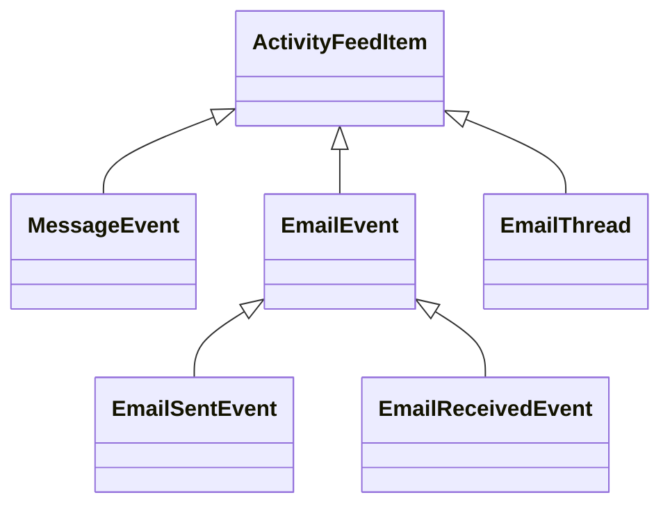

---
# Display h2 to h5 headings
toc_min_heading_level: 2
toc_max_heading_level: 5
---

# Mocks

## Conventions

- Each mocked entity should have the same name as the original entity, prefixed with "Mock". Example: `MockEmailAddress`.
- Each mock function should take an `overrides` object which allows passing predefined data to the mock.  
  <small>**Note**: this only applies to mocks for "object" types</small>
- _TODO: Each mock function should accept a second argument for specifying the `seed`_
- When a property from "EntityA" references "EntityB", the mock for that property should just call the mock generator for "EntityB" (if available). See the examples below.

## Example

Here's a concrete example of implementing mocks for a few entities.

### Diagram



### Type Definitions

:::info
The data models used in this example are **not** real. For brevity reasons, most of the fields are omitted.
:::

```ts
export interface ActivityFeedItem {
  eventType: string;
  createdAt: number;
  updatedAt: number;
}

export interface MessageEvent extends ActivityFeedItem {
  content: string;
  direction: "INBOUND" | "OUTBOUND";
  eventType: "message_event";
}

export declare type EmailAddress = {
  name: string;
  address: string;
};

export declare type EmailBaseAttributes = {
  senderEmail: EmailAddress;
  toEmails: EmailAddress[];
  subject: string;
  threadId: string;
  messageId: string;
  bodySnippet: string;
  name: "Email Sent" | "Email Received";
  direction: "inbound" | "outbound";
};

export interface EmailEvent extends EmailBaseAttributes, ActivityFeedItem {
  eventType: "email";
}

export interface EmailSentEvent extends EmailEvent {
  name: "Email Sent";
  direction: "outbound";
}

export interface EmailReceivedEvent extends EmailEvent {
  name: "Email Received";
  direction: "inbound";
}

export interface EmailThread {
  eventType: "email-thread";
  threadId: string;
  events: Array<EmailSentEvent | EmailReceivedEvent>;
}

export type ActivityFeedItemLike =
  | MessageEvent
  | EmailSentEvent
  | EmailReceivedEvent
  | EmailThread;
```

### Mocks

#### MockActivityFeedItem

```ts
export function MockActivityFeedItem(
  overrides: Partial<ActivityFeedItem> = {}
): ActivityFeedItem {
  const result = {
    eventType: faker.word.words(),
    createdAt: new Date(faker.date.recent()).getTime(),
    updatedAt: new Date(faker.date.recent()).getTime(),
  };
  return { ...result, ...overrides };
}
```

#### MockMessageEvent

```ts
export function MockMessageEvent(
  overrides: Partial<MessageEvent> = {}
): MessageEvent {
  const result = {
    ...MockActivityFeedItem(),
    content: faker.word.words(),
    direction: faker.helpers.arrayElement(["INBOUND", "OUTBOUND"]),
    eventType: "message_event",
  };
  return { ...result, ...overrides };
}
```

#### MockEmailAddress

```ts
export function MockEmailAddress(
  overrides: Partial<EmailAddress> = {}
): EmailAddress {
  const result = {
    name: faker.person.fullName(),
    address: faker.internet.email(),
  };
  return { ...result, ...overrides };
}
```

#### MockEmailBaseAttributes

```ts
export function MockEmailBaseAttributes(
  overrides: Partial<EmailBaseAttributes> = {}
): EmailBaseAttributes {
  const result = {
    senderEmail: MockEmailAddress(),
    toEmails: faker.helpers.multiple(() => MockEmailAddress()),
    subject: faker.word.words(),
    threadId: faker.string.alpha(34),
    messageId: faker.string.alpha(34),
    bodySnippet: faker.word.words(),
    name: faker.helpers.arrayElement(["Email Sent", "Email Received"]),
    direction: faker.helpers.arrayElement(["inbound", "outbound"]),
  };
  return { ...result, ...overrides };
}
```

#### MockEmailEvent

```ts
export function MockEmailEvent(
  overrides: Partial<EmailEvent> = {}
): EmailEvent {
  const result = {
    ...MockEmailBaseAttributes(),
    ...MockActivityFeedItem(),
    eventType: "email",
  };
  return { ...result, ...overrides };
}
```

#### MockEmailSentEvent

```ts
export function MockEmailSentEvent(
  overrides: Partial<EmailSentEvent> = {}
): EmailSentEvent {
  const result = {
    ...MockEmailEvent(),
    name: "Email Sent",
    direction: "outbound",
  };
  return { ...result, ...overrides };
}
```

#### MockEmailReceivedEvent

```ts
export function MockEmailReceivedEvent(
  overrides: Partial<EmailReceivedEvent> = {}
): EmailReceivedEvent {
  const result = {
    ...MockEmailEvent(),
    name: "Email Received",
    direction: "inbound",
  };
  return { ...result, ...overrides };
}
```

#### MockEmailThread

```ts
export function MockEmailThread(
  overrides: Partial<EmailThread> = {}
): EmailThread {
  const result = {
    eventType: "email-thread",
    threadId: faker.string.alpha(34),
    events: faker.helpers.multiple(() =>
      faker.helpers.arrayElement([
        MockEmailSentEvent(),
        MockEmailReceivedEvent(),
      ])
    ),
  };
  return { ...result, ...overrides };
}
```

#### MockActivityFeedItemLike

```ts
export function MockActivityFeedItemLike(
  overrides: Partial<ActivityFeedItemLike> = {}
): ActivityFeedItemLike {
  const result = faker.helpers.arrayElement([
    faker.helpers.arrayElement([
      MockMessageEvent(),
      MockEmailSentEvent(),
      MockEmailReceivedEvent(),
      MockEmailThread(),
    ]),
  ]);
  return { ...result, ...overrides };
}
```

### Usage

#### Defaults

```ts
const randomMessageEvent = MockMessageEvent();
const randomEmailThread = MockEmailThread();

// returns one of MessageEvent, EmailSentEvent, EmailReceivedEvent or EmailThread
const randomActivityFeedItemLike = MockActivityFeedItem();
```

#### Overrides

##### Properties

```ts
const messageEvent = MockMessageEvent({
  content: "Hardcoded message for this particular test",
});
```

##### Nested properties

If you need more control of the threads, for example making sure the `sender` and `to` email addresses are correct:

```ts
const agentEmail: EmailAddress = {
  name: "Michael Scott",
  address: "michael.scott@regal.io",
};

const contactEmail: EmailAddress = {
  name: "Holly Flax",
  address: "holly.flax@gmail.com",
};

const emailThread = MockEmailThread({
  events: [
    MockEmailSentEvent({ senderEmail: agentEmail, toEmails: [contactEmail] }),
    MockEmailReceivedEvent({
      senderEmail: contactEmail,
      toEmails: [agentEmail],
    }),
  ],
});
```
